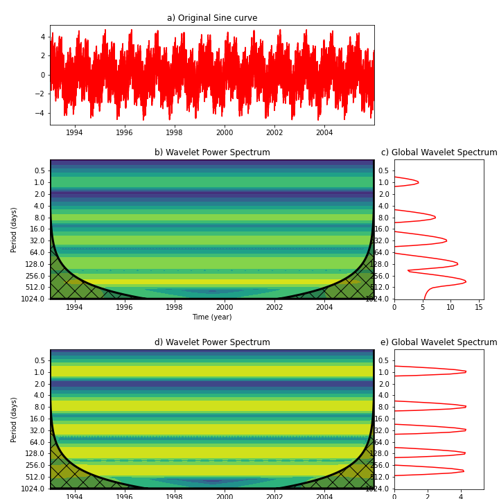
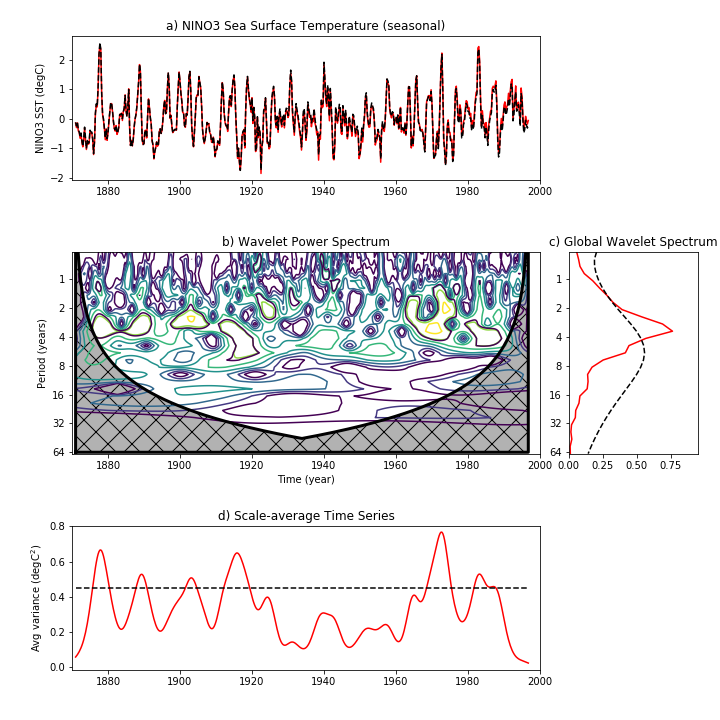

# Wavelet Analysis in Python

Wavelet anaysis tool by Torrence and Compo [1998] is very popular in climatology. However, Liu et al. [2007] has pointed out that the method by Torrence and Compo [1998] has a bias in favor of large scales. These Jupyter Noteboos in Python are the translations from the original MATLAB programs.

**wavelet_test_sine.ipynb**

This notebook use an artificial sine curve for a test correponding to Liu et al. [2007].

**wavelet_test_ElNino3_Liu.ipynb**

This notebook is the translation of Liu et al.'s matlab test program
http://ocgweb.marine.usf.edu/~liu/wavelet_test_ElNino3_YLiu.m
to python.

**Python Modules**

These are imported in the above notebooks.

*wavelet.py*: This function is the translation of wavelet.m by Torrence and Compo

*wave_bases.py*: This is translation of wave_bases.m by Torrence and Gilbert P. Compo

*wave_signif.py*: This function is the translation of wave_signif.m by Torrence and Compo. This uses scipy function "chi2" instead of  chisquare_inv

*wavelet_inverse.py*: Inverse continuous wavelet transform. Torrence and Compo (1998), eq. (11)

**Others**

*sst_nino3.dat*: NINO3 data

*wavelet_test_sine.png*: Figure out of wavelet_test_sine.ipynb

'nino3_TorrenceCompo.png',*nino3_liu.png*: Figure outputs of wavelet_test_ElNino3_Liu.ipynb 

**References:**

Liu, Y., X.S. Liang, and R.H. Weisberg, 2007: Rectification of the bias in the wavelet power spectrum. Journal of Atmospheric and Oceanic Technology, 24(12), 2093-2102. http://ocgweb.marine.usf.edu/~liu/wavelet.html

Torrence, C., and G. P. Compo, 1998: A practical guide to wavelet analysis. Bull. Amer. Meteor. Soc., 79, 61-78. http://paos.colorado.edu/research/wavelets/
